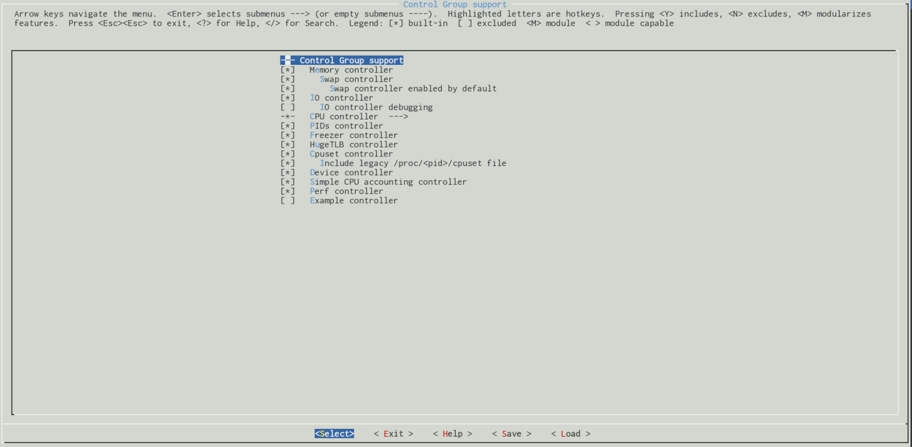

## Kontrol Grupları

### Giriş

`Cgroups` , işlemci süresi, grup başına işlem sayısı, kontrol grubu başına bellek miktarı veya bir işlem veya işlem kümesi için bu tür kaynakların kombinasyonu 
gibi kaynakları tahsis etmemize olanak tanıyan Linux çekirdeği tarafından sağlanan özel bir mekanizmadır. Gruplar hiyerarşik olarak düzenlenmiştir ve burada bu 
mekanizma, hiyerarşik olduklarından ve alt grupların ebeveynlerinden belirli parametreler kümesini devraldıkları için olağan süreçlere benzer. Ama aslında aynı 
değiller. Normal süreç ağacı her zaman tek iken, kontrol gruplarının birçok farklı hiyerarşisinin aynı anda var olabileceği `Cgroups` ve normal süreçler arasındaki 
temel farklar. Her bir kontrol grubu hiyerarşisi, kontrol grubu alt sistemleri setine eklendiği için bu sıradan bir adım değildi.

Bir 'kontrol grubu alt sistemi' (control group subsystem), bir işlemci süresi veya [pids](https://en.wikipedia.org/wiki/Process_identifier) sayısı  ​​veya başka bir deyişle bir "kontrol grubu" için işlem sayısı gibi bir tür kaynağı temsil eder. Linux çekirdeği, on iki "kontrol grubu alt sistemi" ni takip etmek için destek sağlar:

* `cpuset` - bir gruptaki görevlere ayrı işlemcileri ve bellek düğümlerini atar;
* `cpu` - cgroup görevlerinin işlemci kaynaklarına erişimini sağlamak için zamanlayıcıyı kullanır;
* `cpuacct` - bir grup tarafından işlemci kullanımıyla ilgili raporlar oluşturur;
* `io` - [cihazları engelle] (https://en.wikipedia.org/wiki/Device_file) için okuma / yazma sınırı belirler;
* `memory` - bir gruptaki görev (ler) tarafından bellek kullanımı sınırını belirler;
* `devices` - bir gruptaki görev (ler) ile cihazlara erişime izin verir;
* `freezer` - bir gruptaki görev (ler) i askıya almaya / sürdürmeye izin verir;
* `net_cls` - bir gruptaki görevlerden ağ paketlerini işaretlemeye izin verir;
* `net_prio` - bir grup için ağ arabirimi başına ağ trafiğinin önceliğini dinamik olarak ayarlamanın bir yolunu sağlar;
* `perf_event` - bir gruba [performans olaylarına] (https: //en.wikipedia.org/wiki/Perf_ \ (Linux \)) erişim sağlar;
* `hugetlb` - bir grup için [büyük sayfalar] (https://www.kernel.org/doc/Documentation/vm/hugetlbpage.txt) desteğini etkinleştirir;
* `pid` - bir gruptaki işlemlerin sayısını sınırlar.

Bu kontrol grubu alt sistemlerinin her biri, ilgili konfigürasyon seçeneğine bağlıdır. Örneğin, `cpuset` alt sistemi `CONFIG_CPUSETS` çekirdek yapılandırma seçeneği aracılığıyla etkinleştirilmelidir, `io` alt sistemi `CONFIG_BLK_CGROUP` çekirdek yapılandırma seçeneği vb. aracılığıyla etkinleştirilmelidir. Bu çekirdek yapılandırma seçeneklerinin tümü  ,`General setup → Control Group support` menüsünden bulunabilir:



[proc](https://en.wikipedia.org/wiki/Procfs) dosya sistemi aracılığıyla bilgisayarınızda etkinleştirilmiş kontrol gruplarını görebilirsiniz:

```
$ cat /proc/cgroups 
#subsys_name	hierarchy	num_cgroups	enabled
cpuset	8	1	1
cpu	7	66	1
cpuacct	7	66	1
blkio	11	66	1
memory	9	94	1
devices	6	66	1
freezer	2	1	1
net_cls	4	1	1
perf_event	3	1	1
net_prio	4	1	1
hugetlb	10	1	1
pids	5	69	1
```
veya [sysfs](https://en.wikipedia.org/wiki/Sysfs) ile:

```
$ ls -l /sys/fs/cgroup/
total 0
dr-xr-xr-x 5 root root  0 Dec  2 22:37 blkio
lrwxrwxrwx 1 root root 11 Dec  2 22:37 cpu -> cpu,cpuacct
lrwxrwxrwx 1 root root 11 Dec  2 22:37 cpuacct -> cpu,cpuacct
dr-xr-xr-x 5 root root  0 Dec  2 22:37 cpu,cpuacct
dr-xr-xr-x 2 root root  0 Dec  2 22:37 cpuset
dr-xr-xr-x 5 root root  0 Dec  2 22:37 devices
dr-xr-xr-x 2 root root  0 Dec  2 22:37 freezer
dr-xr-xr-x 2 root root  0 Dec  2 22:37 hugetlb
dr-xr-xr-x 5 root root  0 Dec  2 22:37 memory
lrwxrwxrwx 1 root root 16 Dec  2 22:37 net_cls -> net_cls,net_prio
dr-xr-xr-x 2 root root  0 Dec  2 22:37 net_cls,net_prio
lrwxrwxrwx 1 root root 16 Dec  2 22:37 net_prio -> net_cls,net_prio
dr-xr-xr-x 2 root root  0 Dec  2 22:37 perf_event
dr-xr-xr-x 5 root root  0 Dec  2 22:37 pids
dr-xr-xr-x 5 root root  0 Dec  2 22:37 systemd
```
